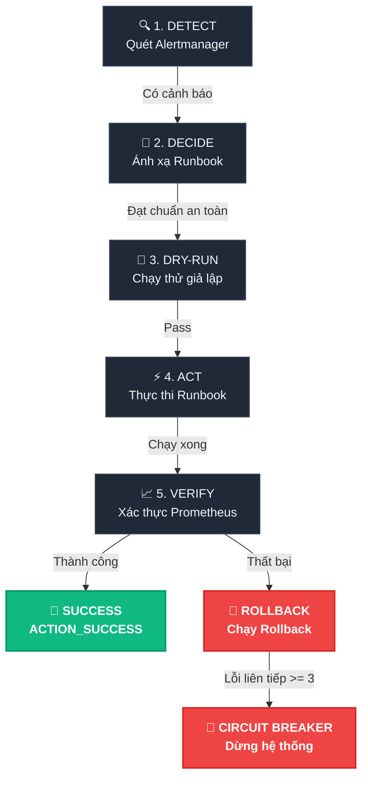

# Giáo Trình: Closed-Loop Auto-Remediation

> [!NOTE]
> Tài liệu học tập và thực hành hệ thống tự động phục hồi sự cố khép kín.

---

# PHẦN I: LÝ THUYẾT VẬN HÀNH

## 1. So Sánh Mô Hình Vận Hành

| Tiêu chí | 🔄 Open-Loop | 🌀 Closed-Loop |
| :--- | :--- | :--- |
| **Quy trình** | Cảnh báo $\rightarrow$ Người $\rightarrow$ SSH $\rightarrow$ Fix | Cảnh báo $\rightarrow$ Robot $\rightarrow$ Runbook $\rightarrow$ Verify |
| **MTTR** | Lâu (15 - 45 phút) | Nhanh (< 1 - 2 phút) |
| **Quy mô** | Giới hạn theo nhân sự | Không giới hạn, chạy song song |
| **Độ tin cậy** | Dễ sai sót dưới áp lực | Nhất quán, tuân thủ chốt chặn |

---

## 2. Chu Trình Phục Hồi MAPE-K



---

## 3. Chốt Chặn An Toàn

> [!IMPORTANT]
> **Nguyên tắc**: Tự động hóa không được phép làm sự cố lan rộng. Robot vận hành phải đi qua 4 chốt chặn sau:

### 📢 1. Dry-run Mode
* **Mục tiêu**: Loại bỏ lỗi cấu hình runbook sai trước khi chạy thật trên môi trường.
* **Cơ chế**: Runbook bắt buộc hỗ trợ cờ `--dry-run` để in lệnh giả lập ra màn hình mà không tác động hệ thống.

### 🛡️ 2. Blast Radius (Bán kính ảnh hưởng)
* **Mục tiêu**: Giới hạn tần suất tác động để ngăn chặn hiện tượng thâu tóm tài nguyên hoặc gây sập dây chuyền.
* **Cơ chế**:
  * Giới hạn tổng số hành động/phút trên toàn hệ thống.
  * Giới hạn số lần restart/giờ của mỗi container.

### 📊 3. Verify & Baseline
* **Mục tiêu**: Xác thực sức khỏe thực tế của dịch vụ sau khi xử lý.
* **Cơ chế**: Lấy tối thiểu $N$ mẫu liên tiếp từ Prometheus để so khớp với ngưỡng trong baseline nhằm tránh nhiễu xung nhịp.

### 🚨 4. Circuit Breaker (Cầu chì)
* **Mục tiêu**: Tự động ngắt khi lỗi nghiêm trọng vượt khả năng tự sửa.
* **Cơ chế**: Đạt ngưỡng 3 lỗi liên tiếp $\rightarrow$ Cầu chì tự chuyển sang trạng thái **OPEN**, dừng hoạt động quét alert và yêu cầu kỹ sư reset thủ công.

---

## 4. Kỹ Thuật Nâng Cao

> [!WARNING]
> Để vận hành an toàn trong môi trường Production thực tế, hệ thống cần xử lý:

* **Tranh chấp đồng thời (Concurrency & Locks)**: Sử dụng luồng song song (Multi-threading) cho các dịch vụ khác nhau. Sử dụng khóa (Mutex) cho từng dịch vụ để chặn chạy đè runbook (`SERVICE_LOCK_BUSY`).
* **Giao dịch đa bước (Transactional Rollback)**: Với chuỗi hành động chạy tuần tự `A -> B -> C`. Nếu xảy ra lỗi ở bước bất kỳ, thực hiện rollback đảo ngược thứ tự LIFO (`Rollback B -> Rollback A`) đối với các bước đã hoàn thành.
* **Chống ảo tưởng LLM (Hallucination Defense)**: So khớp runbook do LLM đề xuất với một **Whitelist Registry** cố định. Nếu không khớp, chặn đứng hành động và báo lỗi `DECISION_VALIDATION_FAILED`.

---
---

# PHẦN II: THỰC HÀNH LAB "RONKI"

## 1. Mô Tả Lab
Hệ thống **Ronki** gồm 5 dịch vụ: `frontend` $\rightarrow$ `api-gateway` $\rightarrow$ (`payment-svc`, `inventory-svc` $\rightarrow$ `checkout-svc`).
Học viên cần lập trình `closed_loop.py` và cấu hình `config.yaml` để tự động hóa phát hiện và xử lý sự cố.

* **Đầu vào (Inputs)**: Docker compose stack, Alert rules, Prometheus metrics và ngưỡng baseline (`baseline.json`).
* **Đầu ra (Outputs)**: Thư mục `ronki-orchestrator` độc lập gồm mã nguồn Python, cấu hình YAML và log định dạng JSON.

---

## 2. 6 Kịch Bản Chaos Test

| Kịch bản | 🎯 Mô tả | 📥 Đầu vào gửi Alert | 📤 Đầu ra kỳ vọng |
| :--- | :--- | :--- | :--- |
| **1. Action Success** | Lỗi latency cao trên `payment-svc`. Phục hồi thành công. | Gửi alert `HighLatency` cho `payment-svc` | `ALERT_DETECTED` $\rightarrow$ `DRY_RUN_PASS` $\rightarrow$ `ACTION_EXECUTED` $\rightarrow$ `ACTION_SUCCESS` |
| **2. Auto-rollback** | Lỗi nặng không thể tự phục hồi. Tự động rollback. | Sửa baseline latency về `1` (ép lỗi), gửi alert `HighLatency` | Verify fail $\rightarrow$ `ROLLBACK_TRIGGERED` $\rightarrow$ `ROLLBACK_EXECUTED` |
| **3. Circuit Breaker** | Lỗi liên tiếp diện rộng. Đứt cầu chì để bảo vệ hệ thống. | Gửi liên tiếp 3 alert khác nhau (khi baseline latency vẫn bằng `1`) | 3 lần verify lỗi liên tiếp $\rightarrow$ Xuất log `CIRCUIT_BREAKER_HALT`, dừng hệ thống |
| **4. Multi-step Deploy** | Deploy đa bước lỗi Step C. Phải rollback ngược thứ tự LIFO. | Gửi alert `MultiStepDeploy`. Tắt container `api-gateway` trước Step C | `TRANSACTIONAL_STEP_FAIL` $\rightarrow$ `TRANSACTIONAL_ROLLBACK_STEP` (B rồi tới A) $\rightarrow$ `TRANSACTIONAL_ROLLBACK_COMPLETE` |
| **5. Concurrency Race** | Nhiều alert đến cùng lúc. Xử lý song song và khóa trùng lặp. | Gửi đồng thời alert cho `payment-svc` & `inventory-svc`, sau đó gửi alert trùng của `payment-svc` | 2 dịch vụ chạy song song không block. Alert trùng thứ 3 bị khóa (`SERVICE_LOCK_BUSY`) |
| **6. LLM Defense** | LLM quyết định chạy runbook lạ không có trong whitelist. | Gửi alert `TestHallucination` trỏ tới script ngoài whitelist | Lập tức chặn đứng hành động $\rightarrow$ xuất log `DECISION_VALIDATION_FAILED` |

---

## 3. Lệnh Chạy Terminal

### Terminal 1: Khởi động hệ thống & Tạo tải
```bash
# Khởi chạy Docker Stack
bash data-pack/scripts/start_stack.sh

# Khởi chạy luồng sinh tải liên tục
python -c "import urllib.request, time, threading; urls=['http://localhost:8080/', 'http://localhost:8081/', 'http://localhost:8082/', 'http://localhost:8083/', 'http://localhost:8084/']; [threading.Thread(target=lambda u: [ (urllib.request.urlopen(u).read(), time.sleep(0.2)) for _ in iter(int, 1) ], daemon=True).start() for u in urls]; time.sleep(999999)"
```

### Terminal 2: Chạy Orchestrator
```bash
# Cài đặt thư viện và khởi chạy
uv pip install requests pyyaml prometheus_client
cd ronki-orchestrator
uv run python closed_loop.py --config config.yaml
```

### Terminal 3: Gửi Lệnh Chaos Test (Đầy Đủ 6 Kịch Bản & Nhật Ký Kỳ Vọng)

Học viên sử dụng Terminal 3 để gửi các lệnh trigger sự cố (gửi alert hoặc chaos command), sau đó quan sát **Terminal 2 (Orchestrator)** để đối chiếu với nhật ký hệ thống kỳ vọng dưới đây:

#### 1️⃣ Kịch bản 1: Phục hồi thành công (Action Success)
* **Lệnh gửi alert từ Terminal 3:**
```bash
curl -H "Content-Type: application/json" -d '[{"labels":{"alertname":"HighLatency","service":"payment-svc","severity":"warning","uniq":"scen-1"}}]' http://localhost:9093/api/v2/alerts
```
* **Nhật ký kỳ vọng tại Terminal 2:**
Khi nhận alert `HighLatency`, Orchestrator chạy chu trình: Phát hiện (`ALERT_DETECTED`) $\rightarrow$ Map runbook (`DECIDE_RUNBOOK`) $\rightarrow$ Check an toàn (`BLAST_RADIUS_OK`) $\rightarrow$ Chạy thử (`DRY_RUN_PASS`) $\rightarrow$ Chạy thật (`ACTION_EXECUTED`) $\rightarrow$ Thăm dò metrics từ Prometheus đạt chuẩn (`VERIFY_PASS`) $\rightarrow$ Thành công (`ACTION_SUCCESS`).
*Log mẫu:*
```json
{"ts":"...","level":"INFO","event_type":"ALERT_DETECTED","alertname":"HighLatency","service":"payment-svc","severity":"warning"}
{"ts":"...","level":"INFO","event_type":"DECIDE_RUNBOOK","alertname":"HighLatency","service":"payment-svc","runbook":"runbooks/restart_service.sh"}
{"ts":"...","level":"INFO","event_type":"BLAST_RADIUS_OK","service":"payment-svc"}
{"ts":"...","level":"INFO","event_type":"DRY_RUN_PASS","runbook":"runbooks/restart_service.sh","service":"payment-svc"}
{"ts":"...","level":"INFO","event_type":"ACTION_EXECUTED","runbook":"runbooks/restart_service.sh","service":"payment-svc"}
{"ts":"...","level":"INFO","event_type":"VERIFY_START","service":"payment-svc","timeout_s":60}
{"ts":"...","level":"INFO","event_type":"VERIFY_SAMPLE","sample":1,"latency_p99_ms":312.4,"up":1.0,"latency_ok":true,"up_ok":true}
{"ts":"...","level":"INFO","event_type":"VERIFY_SAMPLE","sample":2,"latency_p99_ms":198.7,"up":1.0,"latency_ok":true,"up_ok":true}
{"ts":"...","level":"INFO","event_type":"VERIFY_SAMPLE","sample":3,"latency_p99_ms":201.1,"up":1.0,"latency_ok":true,"up_ok":true}
{"ts":"...","level":"INFO","event_type":"VERIFY_PASS","service":"payment-svc","samples":3}
{"ts":"...","level":"INFO","event_type":"ACTION_SUCCESS","alertname":"HighLatency","service":"payment-svc","runbook":"runbooks/restart_service.sh"}
```

#### 2️⃣ Kịch bản 2: Lỗi verify -> Tự động Rollback
*(Lưu ý: Cần sửa giá trị `"latency_p99_max_ms"` từ `500` thành `1` trong file `data-pack/data/baseline.json` trước khi chạy lệnh. 
Bạn có thể chạy nhanh lệnh sau trong **PowerShell** để tự động sửa mà không cần mở file:
```powershell
(Get-Content data-pack/data/baseline.json) -replace '"latency_p99_max_ms": 500', '"latency_p99_max_ms": 1' | Set-Content data-pack/data/baseline.json
```
Hoặc nếu chạy trong **Bash (WSL 2 / Git Bash)**:
```bash
sed -i 's/"latency_p99_max_ms": 500/"latency_p99_max_ms": 1/g' data-pack/data/baseline.json
```
)*
* **Lệnh gửi alert từ Terminal 3:**
```bash
curl -H "Content-Type: application/json" -d '[{"labels":{"alertname":"HighLatency","service":"payment-svc","severity":"warning","uniq":"scen-2"}}]' http://localhost:9093/api/v2/alerts
```
* **Nhật ký kỳ vọng tại Terminal 2:**
Do baseline được hạ xuống `1` ms, bước Verify của Orchestrator sẽ liên tục thất bại vì độ trễ thực tế lớn hơn 1ms. Hết 60s timeout, Orchestrator kết luận `VERIFY_FAIL` $\rightarrow$ Tự động kích hoạt `ROLLBACK_TRIGGERED` $\rightarrow$ Khôi phục lại trạng thái (`ROLLBACK_EXECUTED`).
*Log mẫu:*
```json
{"ts":"...","level":"INFO","event_type":"ACTION_EXECUTED","runbook":"runbooks/restart_service.sh","service":"payment-svc"}
{"ts":"...","level":"INFO","event_type":"VERIFY_START","service":"payment-svc","timeout_s":60}
{"ts":"...","level":"INFO","event_type":"VERIFY_SAMPLE","sample":1,"latency_p99_ms":145.2,"up":1.0,"latency_ok":false,"up_ok":true}
...
{"ts":"...","level":"WARNING","event_type":"VERIFY_FAIL","service":"payment-svc","samples":6}
{"ts":"...","level":"WARNING","event_type":"ROLLBACK_TRIGGERED","service":"payment-svc","rollback_runbook":"runbooks/restart_service.sh"}
{"ts":"...","level":"INFO","event_type":"ROLLBACK_EXECUTED","service":"payment-svc","rollback_runbook":"runbooks/restart_service.sh"}
```

#### 3️⃣ Kịch bản 3: Sập cầu chì bảo vệ (Circuit Breaker)
*(Đảm bảo giá trị `"latency_p99_max_ms"` vẫn bằng `1`. Gửi liên tiếp 3 alert để kích hoạt cầu chì nhảy)*
* **Lệnh gửi các alert liên tiếp từ Terminal 3:**
```bash
curl -H "Content-Type: application/json" -d '[{"labels":{"alertname":"HighLatency","service":"payment-svc","severity":"warning","uniq":"cb-1"}}]' http://localhost:9093/api/v2/alerts

curl -H "Content-Type: application/json" -d '[{"labels":{"alertname":"HighLatency","service":"inventory-svc","severity":"warning","uniq":"cb-2"}}]' http://localhost:9093/api/v2/alerts

curl -H "Content-Type: application/json" -d '[{"labels":{"alertname":"HighLatency","service":"checkout-svc","severity":"warning","uniq":"cb-3"}}]' http://localhost:9093/api/v2/alerts
```
* **Nhật ký kỳ vọng tại Terminal 2:**
Sau khi ghi nhận đủ 3 lần verify thất bại liên tiếp (mỗi lần đều qua chu trình Act $\rightarrow$ Verify Fail $\rightarrow$ Rollback), Orchestrator lập tức ngắt cầu chì `CIRCUIT_BREAKER_HALT`. Các chu kỳ sau đó chỉ in cảnh báo cầu chì đang mở và dừng quét sự cố.
*Log mẫu:*
```json
{"ts":"...","level":"ERROR","event_type":"CIRCUIT_BREAKER_HALT","consecutive_failures":3,"threshold":3,"message":"Automation halted. Manual intervention required."}
{"ts":"...","level":"ERROR","event_type":"CIRCUIT_BREAKER_HALT","message":"Circuit open — polling suspended."}
```
*(Khôi phục trạng thái hệ thống sau khi kết thúc Kịch bản 3:
1. Chạy lệnh sau để tự động khôi phục giá trị `"latency_p99_max_ms"` từ `1` về lại `500` thông qua terminal:
   - Trong **PowerShell**:
     ```powershell
     (Get-Content data-pack/data/baseline.json) -replace '"latency_p99_max_ms": 1', '"latency_p99_max_ms": 500' | Set-Content data-pack/data/baseline.json
     ```
   - Trong **Bash (WSL 2 / Git Bash)**:
     ```bash
     sed -i 's/"latency_p99_max_ms": 1/"latency_p99_max_ms": 500/g' data-pack/data/baseline.json
     ```
2. Tại Terminal 2 (nơi chạy Orchestrator đang bị sập cầu chì), nhấn tổ hợp phím `Ctrl + C` để tắt tiến trình Python cũ.
3. Khởi động lại Orchestrator tại Terminal 2 bằng cách chạy lại lệnh:
   ```bash
   uv run python closed_loop.py --config config.yaml
   ```
   Việc này sẽ xóa bộ đếm thất bại liên tiếp trong RAM của bộ nhớ và nạp lại baseline cấu hình chuẩn.)*

#### 4️⃣ Kịch bản 4: Triển khai đa bước & Rollback ngược thứ tự (Transactional)
* **Lệnh gửi alert từ Terminal 3:**
```bash
# Bấm gửi alert MultiStepDeploy
curl -H "Content-Type: application/json" -d '[{"labels":{"alertname":"MultiStepDeploy","service":"api-gateway","severity":"warning","uniq":"scen-4"}}]' http://localhost:9093/api/v2/alerts

# Sau khoảng 2 giây (khi Terminal 2 hiện đang chạy Step B), chạy lệnh này để tắt container làm lỗi Step C
docker stop ronki-api-gateway
```
* **Nhật ký kỳ vọng tại Terminal 2:**
Orchestrator chạy chuỗi 3 bước A $\rightarrow$ B $\rightarrow$ C. Vì Step C bị lỗi (do container đã bị stop), giao dịch thất bại `TRANSACTIONAL_STEP_FAIL` (ghi rõ Step C lỗi và Step A, B đã chạy trước đó). Kích hoạt rollback đảo ngược thứ tự LIFO: rollback Step B rồi tới Step A (`TRANSACTIONAL_ROLLBACK_STEP`) $\rightarrow$ báo hoàn tất khôi phục (`TRANSACTIONAL_ROLLBACK_COMPLETE`).
*Log mẫu:*
```json
{"ts":"...","level":"ERROR","event_type":"TRANSACTIONAL_STEP_FAIL","step":"runbooks/multi_step_deploy.sh --step-c","service":"api-gateway","completed_before_failure":["runbooks/multi_step_deploy.sh --step-a","runbooks/multi_step_deploy.sh --step-b"]}
{"ts":"...","level":"WARNING","event_type":"TRANSACTIONAL_ROLLBACK_STEP","step":"runbooks/multi_step_deploy.sh --rollback-b","service":"api-gateway"}
{"ts":"...","level":"WARNING","event_type":"TRANSACTIONAL_ROLLBACK_STEP","step":"runbooks/multi_step_deploy.sh --rollback-a","service":"api-gateway"}
{"ts":"...","level":"INFO","event_type":"TRANSACTIONAL_ROLLBACK_COMPLETE","service":"api-gateway","rolled_back":["runbooks/multi_step_deploy.sh --rollback-b","runbooks/multi_step_deploy.sh --rollback-a"]}
```
*(Khôi phục container sau test: `docker start ronki-api-gateway`)*

#### 5️⃣ Kịch bản 5: Xử lý đồng thời (Concurrency & Locks)
* **Lệnh gửi các alert đồng thời và trùng lặp từ Terminal 3:**
```bash
# Gửi đồng thời hai alert của payment-svc và inventory-svc
curl -H "Content-Type: application/json" -d '[{"labels":{"alertname":"HighLatency","service":"payment-svc","uniq":"concur-1"},"labels":{"alertname":"HighLatency","service":"inventory-svc","uniq":"concur-2"}}]' http://localhost:9093/api/v2/alerts

# Gửi ngay lập tức alert trùng lặp tiếp theo của payment-svc (sau 2 giây)
curl -H "Content-Type: application/json" -d '[{"labels":{"alertname":"HighLatency","service":"payment-svc","uniq":"concur-3"}}]' http://localhost:9093/api/v2/alerts
```
* **Nhật ký kỳ vọng tại Terminal 2:**
Hai tiến trình xử lý `payment-svc` và `inventory-svc` chạy song song trên 2 thread khác nhau, ghi nhận log `DRY_RUN_PASS` tại cùng một thời điểm. Alert trùng lặp thứ 3 của `payment-svc` bị chặn lại do có mutex lock đang khóa, in log `SERVICE_LOCK_BUSY`.
*Log mẫu:*
```json
{"ts":"2026-06-19T10:00:01.123Z","level":"INFO","event_type":"DRY_RUN_PASS","runbook":"...","service":"payment-svc"}
{"ts":"2026-06-19T10:00:01.345Z","level":"INFO","event_type":"DRY_RUN_PASS","runbook":"...","service":"inventory-svc"}
...
{"ts":"2026-06-19T10:00:02.500Z","level":"WARNING","event_type":"SERVICE_LOCK_BUSY","service":"payment-svc","message":"Another runbook is executing for this service; skipping duplicate"}
```

#### 6️⃣ Kịch bản 6: Chống ảo tưởng LLM (Hallucination Defense)
* **Lệnh gửi alert từ Terminal 3:**
```bash
curl -H "Content-Type: application/json" -d '[{"labels":{"alertname":"TestHallucination","service":"payment-svc","severity":"warning","uniq":"scen-6"}}]' http://localhost:9093/api/v2/alerts
```
* **Nhật ký kỳ vọng tại Terminal 2:**
Orchestrator nhận alert trỏ tới runbook lạ không có trong whitelist. Hệ thống ngay lập tức chặn đứng, in log `DECISION_VALIDATION_FAILED` và không thực thi thêm bất cứ hành động nào.
*Log mẫu:*
```json
{"ts":"...","level":"INFO","event_type":"ALERT_DETECTED","alertname":"TestHallucination","service":"payment-svc"}
{"ts":"...","level":"ERROR","event_type":"DECISION_VALIDATION_FAILED","bad_runbook":"runbooks/nonexistent_runbook.sh","alertname":"TestHallucination","raw_decision":"runbooks/nonexistent_runbook.sh","action":"escalate_no_auto_action"}
```
