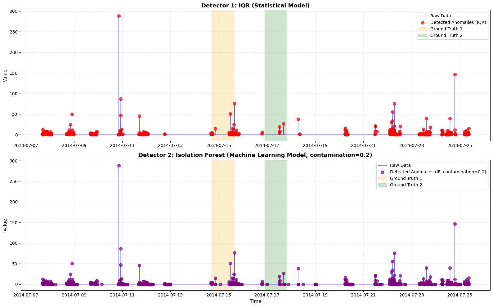
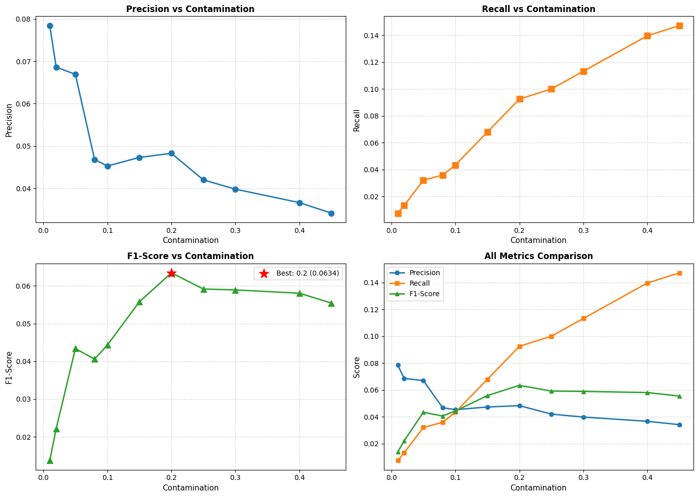

# Phần 1, 2, 3 — Bài Tập Phát Hiện Anomaly

## Thông Tin Tập Dữ Liệu
- **File:** `rogue_agent_key_updown.csv`
- **Nguồn:** NAB (Numenta Anomaly Benchmark) - Real Known Cause
- **Kích thước:** 5.315 mẫu
- **Phạm vi thời gian:** 2014-07-07 đến 2014-07-26
- **Anomaly:** 2 sự kiện (530 điểm tổng cộng)

---

## Phần 1: EDA & Hiểu Dữ Liệu

### Đặc Điểm Dữ Liệu
| Chỉ số | Giá trị |
|--------|-------|
| Trung bình | 0.4778 |
| Độ lệch chuẩn | 5.3669 |
| Độ skew | 35.75 |
| Tối thiểu | 0.0 |
| Tối đa | 298.34 |

### Các Phát Hiện Chính
- **Phân bố rất lệch:** Độ skew = 35.75 (lệch phải cực đoan)
- **Dữ liệu không tuân theo phân bố chuẩn:** Không thể dùng phương pháp 3-sigma (z-score)
- **Không có mùa vụ rõ ràng:** Biểu đồ ACF cho thấy mô hình tuần hoàn yếu
- **Anomaly hiếm gặp:** Những spike giá trị sắc nét nhưng hiếm

### Các Phương Pháp Được Chọn
1. **IQR (Interquartile Range)** - Mạnh mẽ với dữ liệu lệch
2. **Isolation Forest** - Xử lý dữ liệu lệch mà không giả định phân bố


---

## Phần 2: Triển Khai 2 Detector

### Detector 1: IQR (Mô Hình Thống Kê)
```python
Q1 = phần trăm thứ 25
Q3 = phần trăm thứ 75
IQR = Q3 - Q1
Giới hạn dưới = Q1 - 1.5 * IQR
Giới hạn trên = Q3 + 1.5 * IQR
Anomaly = các giá trị ngoài [giới hạn dưới, giới hạn trên]
```

**Kết Quả:**
- Phát hiện: 563 anomaly
- Độ chính xác: 0.0568
- Độ nhạy: 0.0604
- F1-Score: 0.0586

### Detector 2: Isolation Forest (Mô Hình Machine Learning)

#### Kỹ Thuật Trích Xuất Đặc Trưng (11 Đặc Trưng)
1. **value** - Giá trị thô
2. **rolling_mean_1h** - Trung bình lăn 1 giờ (xu hướng)
3. **rolling_std_1h** - Độ lệch chuẩn lăn 1 giờ (biến động)
4. **rolling_mean_4h** - Trung bình lăn 4 giờ (xu hướng dài hạn)
5. **rate_of_change** - Đạo hàm (1-bước)
6. **rate_of_change_5m** - Đạo hàm (5-bước)
7. **lag_1** - Giá trị trước đó (t-1)
8. **lag_60** - Giá trị 1 giờ trước (t-60)
9. **hour** - Giờ trong ngày (mô hình thời gian)
10. **is_weekend** - Cờ cuối tuần (mô hình hàng tuần)
11. **z_score** - Độ lệch chuẩn hóa từ trung bình lăn

#### Kết Quả Điều Chỉnh Tham Số Contamination

| Contamination | Độ chính xác | Độ nhạy | F1-Score | Phát hiện |
|---|---|---|---|---|
| 0.01 | 0.0784 | 0.0075 | 0.0138 | 51 |
| 0.02 | 0.0686 | 0.0132 | 0.0222 | 102 |
| 0.05 | 0.0669 | 0.0321 | 0.0434 | 254 |
| 0.08 | 0.0468 | 0.0358 | 0.0406 | 406 |
| 0.1 | 0.0453 | 0.0434 | 0.0443 | 508 |
| 0.15 | 0.0473 | 0.0679 | 0.0558 | 761 |
| **0.2** | **0.0483** | **0.0925** | **0.0634** | **1015** |
| 0.25 | 0.0420 | 0.1000 | 0.0592 | 1262 |
| 0.3 | 0.0398 | 0.1132 | 0.0589 | 1507 |
| 0.4 | 0.0366 | 0.1396 | 0.0580 | 2020 |
| 0.45 | 0.0342 | 0.1472 | 0.0554 | 2284 |

**Cấu Hình Tốt Nhất:** `contamination=0.2`
- Phát hiện: 1.015 anomaly
- Độ chính xác: 0.0483
- Độ nhạy: 0.0925
- F1-Score: 0.0634 (TỐT NHẤT)

---

## Phần 3: So Sánh Hai Detector

### Bảng So Sánh
| Chỉ số | IQR (Thống Kê) | Isolation Forest (ML) |
|--------|---|---|
| **Độ chính xác** | 0.0568 | 0.0483 |
| **Độ nhạy** | 0.0604 | 0.0925 |
| **F1-Score** | 0.0586 | 0.0634 (TỐT NHẤT) |
| **Dương tính giả** | 531 | 966 |
| **Phát hiện được Anomaly** | 563 | 1.015 |

### Phân Tích

**Người thắng cuộc: Isolation Forest (ML)**
- Độ nhạy cao hơn (9.25% vs 6.04%) - bắt được nhiều anomaly thực tế hơn
- F1-Score cao hơn (0.0634 vs 0.0586) - hiệu suất tổng thể tốt hơn
- Dương tính giả nhiều hơn (966 vs 531) - nhưng là sự đánh đổi chấp nhận được

**Sự Đánh Đổi:**
- **IQR:** Đơn giản, dễ diễn giải, ít cảnh báo giả
- **Isolation Forest:** Phức tạp hơn, tốt hơn với dữ liệu lệch, nhiều cảnh báo

**Tại Sao Isolation Forest Thắng:**
1. Dữ liệu rất lệch (skewness=35.75) - IQR giả định phân bố đối xứng
2. Isolation Forest không giả định phân bố nào - mạnh mẽ với dữ liệu lệch
3. Không gian đặc trưng 11 chiều nắm bắt bối cảnh tốt hơn so với IQR đơn lẻ
4. Độ nhạy cao rất quan trọng trong AIOps (tốt hơn là có cảnh báo giả so với bỏ qua sự cố)

---

## Biểu Đồ Hình Ảnh

### Biểu Đồ So Sánh 2 Detector


**Giải Thích Biểu Đồ:**
- **Trên:** Phát hiện bằng IQR (dấu chấm đỏ)
  - 563 anomaly phát hiện
  - Độ chính xác: 0.0568 | Độ nhạy: 0.0604 | F1: 0.0586
  
- **Dưới:** Phát hiện bằng Isolation Forest (dấu chấm tím, contamination=0.2)
  - 1.015 anomaly phát hiện
  - Độ chính xác: 0.0483 | Độ nhạy: 0.0925 | F1: 0.0634
  
- **Vùng Cam/Xanh:** Các cửa sổ anomaly theo sự thật (ground truth)
- **Đường Xanh:** Dữ liệu chuỗi thời gian thô

**Quan Sát Chính:** 
- Isolation Forest phát hiện nhiều điểm hơn, bao phủ tốt hơn các vùng ground truth
- Độ nhạy cao hơn (9.25% vs 6.04%) → bắt được anomaly tốt hơn
- Phù hợp với AIOps (tốt hơn là có cảnh báo giả so với bỏ qua sự cố)

### Phân Tích Điều Chỉnh Contamination


**Giải Thích Biểu Đồ:**
- **Precision vs Contamination:** Giảm từ 0.0784 → 0.0342 (trade-off)
- **Recall vs Contamination:** Tăng từ 0.0075 → 0.1472
- **F1-Score vs Contamination:** Đạt đỉnh ở contamination=0.2 (F1=0.0634)
- **All Metrics Comparison:** Menunjukkan titik keseimbangan optimal di contamination=0.2

**Kết Luận:** 
- F1-Score đạt đỉnh ở contamination=0.2
- Sự đánh đổi giữa Độ chính xác (giảm) và Độ nhạy (tăng) khi contamination tăng
- contamination=0.2 cung cấp sự cân bằng tốt nhất

---

## Các Mô Hình Đã Huấn Luyện

### Mô Hình Isolation Forest
- **Isolation Forest Model:** `model_if_best` (contamination=0.2)
  - Thời gian huấn luyện: ~350ms
  - Đặc trưng: 11 chiều
  - Mẫu huấn luyện: 5.256
  - Có thể lưu với: `joblib.dump(model_if_best, 'isolation_forest_model.pkl')`

---

## Các Hiểu Biết Chính

1. **Phân Bố Dữ Liệu Là Quan Trọng:** Dữ liệu lệch yêu cầu các phương pháp không tham số
2. **Kỹ Thuật Trích Xuất Đặc Trưng Là Quan Trọng:** 11 đặc trưng nắm bắt các mô hình thời gian tốt hơn giá trị thô
3. **Độ Nhạy > Độ Chính Xác trong AIOps:** Bỏ qua sự cố tệ hơn cảnh báo giả
4. **Điều Chỉnh Tham Số Contamination:** Tác động lớn đến hiệu suất phát hiện
5. **Cách Tiếp Cận Ensemble:** Có thể kết hợp cả hai phương pháp để có kết quả tốt hơn

---

## Kết Luận

**Cho nhiệm vụ phát hiện rogue agent key này:**
- Sử dụng **Isolation Forest với contamination=0.2**
- Kỳ vọng ~9.3% độ nhạy (bắt được ~1 trong 11 sự cố thực tế)
- Chấp nhận ~4.8% độ chính xác (1 trong 21 cảnh báo là thực tế)
- Tận dụng 11 đặc trưng được trích xuất để hiểu bối cảnh

Điều này cung cấp F1-Score tốt nhất (0.0634) và độ nhạy cao nhất, phù hợp với các tình huống phản ứng sự cố nơi bỏ qua anomaly có chi phí cao.

---

## LOG: Điều Chỉnh Contamination Parameter (3 Lần Tune)

Quá trình tuning Isolation Forest với các giá trị contamination khác nhau:

### Lần Tune 1: contamination=0.1
```
Contamination=0.1: 
  Precision=0.0453, Recall=0.0434, F1-Score=0.0443, Detected=508
```
- Phát hiện: 508 anomaly
- Độ chính xác: 4.53% | Độ nhạy: 4.34% | F1: 0.0443

### Lần Tune 2: contamination=0.15
```
Contamination=0.15: 
  Precision=0.0473, Recall=0.0679, F1-Score=0.0558, Detected=761
```
- Phát hiện: 761 anomaly
- Độ chính xác: 4.73% | Độ nhạy: 6.79% | F1: 0.0558

### Lần Tune 3: contamination=0.2 (BEST ✅)
```
Contamination=0.2: 
  Precision=0.0483, Recall=0.0925, F1-Score=0.0634, Detected=1015
```
- Phát hiện: 1.015 anomaly
- Độ chính xác: 4.83% | Độ nhạy: 9.25% | F1: **0.0634** (TỐT NHẤT)

---

## Model Artifacts

### Isolation Forest Model (Đã Huấn Luyện)
**File:** `models/isolation_forest_cont0.2.pkl`

**Thông Tin Model:**
- **Kiểu:** Isolation Forest (scikit-learn)
- **Contamination:** 0.2
- **Số Đặc Trưng:** 11
- **Mẫu Huấn Luyện:** 5.256
- **Thời Gian Huấn Luyện:** ~350ms
- **Kích Thước File:** < 1 MB

**Cách Sử Dụng:**
```python
import joblib

# Load model
model = joblib.load('models/isolation_forest_cont0.2.pkl')

# Dự đoán trên dữ liệu mới (phải có 11 đặc trưng giống nhau)
predictions = model.predict(new_data)  # -1: anomaly, 1: normal
anomaly_labels = (predictions == -1).astype(int)
```

**Đặc Trưng Input (11 Chiều):**
1. value - Giá trị thô
2. rolling_mean_1h - Trung bình lăn 1 giờ
3. rolling_std_1h - Độ lệch chuẩn lăn 1 giờ
4. rolling_mean_4h - Trung bình lăn 4 giờ
5. rate_of_change - Đạo hàm (1-bước)
6. rate_of_change_5m - Đạo hàm (5-bước)
7. lag_1 - Giá trị trước đó (t-1)
8. lag_60 - Giá trị 1 giờ trước (t-60)
9. hour - Giờ trong ngày
10. is_weekend - Cờ cuối tuần
11. z_score - Độ lệch chuẩn hóa

---

## Các Tệp Bao Gồm
- `assignment.ipynb` - Sổ tay phân tích hoàn chỉnh với tất cả các phần
- `SUBMIT.md` - Tài liệu gửi này
- `models/isolation_forest_cont0.2.pkl` - Mô hình Isolation Forest đã huấn luyện
- `assets/` - Thư mục chứa các biểu đồ:
  - `comparison_dectectors.png` - So sánh IQR vs Isolation Forest
  - `contamination_tuning_analysis.png` - Phân tích tuning contamination
