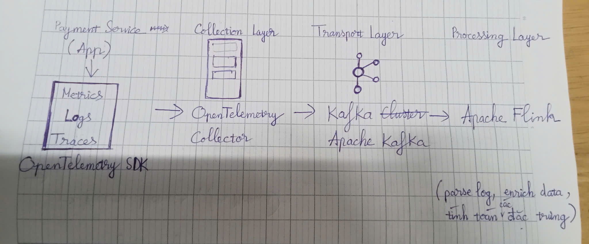
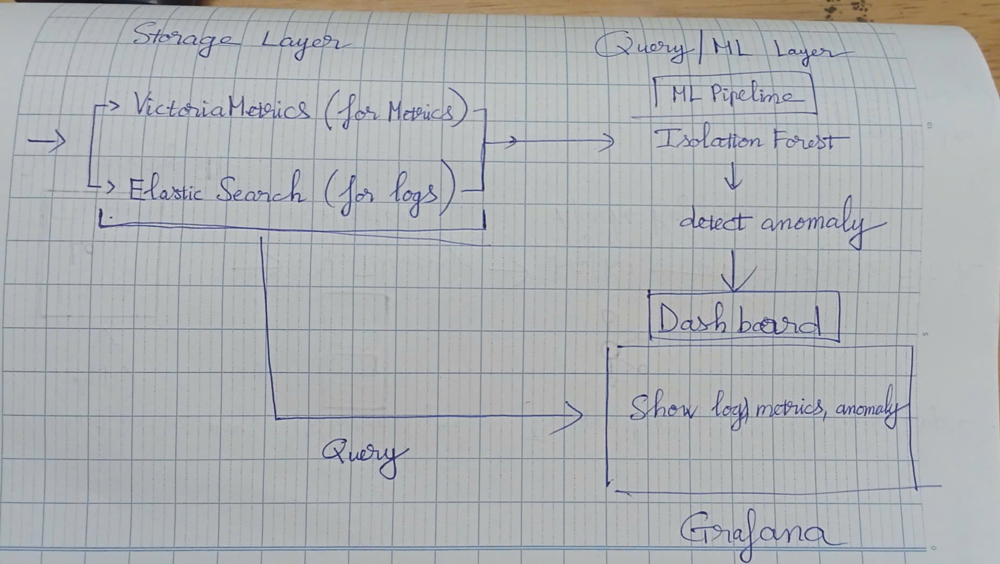

# Architecture: Payment Service Anomaly Detection

## 1. Flow Diagram
[Payment Service](App)
  --> [OpenTelemetry SDK] (Metrics: Latency, Error Rate / Logs / Traces)
  --> [OTel Collector] (Collection)
  --> [Kafka Cluster] (Transport / Buffer)
  --> [VictoriaMetrics] (Time-series Storage for Metrics) và [Elasticsearch] (Hot Storage for Logs)
  --> [Isolation Forest Model] (AI Anomaly Detector) --> [Grafana] (Query and Dashboard)

## 2. Tool Choice