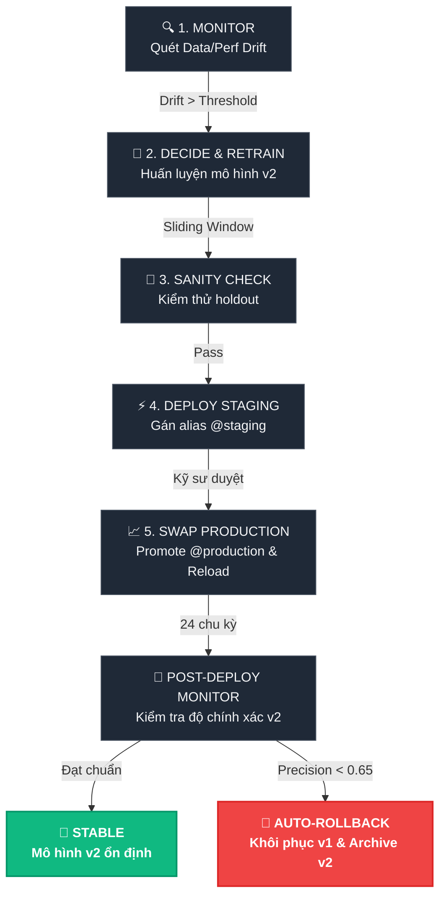

# Giáo Trình: MLOps Lifecycle & Automation

> [!NOTE]
> Tài liệu học tập và thực hành quy trình MLOps khép kín: Giám sát drift, tự động tái huấn luyện và cơ chế rollback bảo vệ hệ thống.

---

# PHẦN I: LÝ THUYẾT VẬN HÀNH

## 1. So Sánh Mô Hình Vận Hành Mô Hình (Model Operations)

| Tiêu chí | 🕰️ Vận hành Tĩnh (Static MLOps) | 🌀 Chu kỳ Tự động (Dynamic MLOps) |
| :--- | :--- | :--- |
| **Giám sát hiệu năng** | Kiểm tra thủ công định kỳ / Ad-hoc | Tự động quét và cảnh báo Drift (Combined Mode) |
| **Tái huấn luyện** | ML Engineer train thủ công khi có sự cố | Kích hoạt tự động khi drift vượt ngưỡng |
| **Phục vụ & Deploy** | Thay thế file model trực tiếp, restart API | Blue-Green swap qua MLflow registry alias, reload API |
| **Rollback sự cố** | Khó khăn, mất thời gian phục hồi container | Tự động Rollback tức thì (< 5s) khi model mới suy giảm |
| **Rủi ro vận hành** | Cao (dễ mất mát doanh thu khi model decay) | Thấp (chốt chặn an toàn bảo vệ SLA) |

---

## 2. Chu Trình MLOps Lifecycle (MAPE-ML)



---

## 3. Chốt Chặn An Toàn (Safety Gates)

> [!IMPORTANT]
> **Nguyên tắc**: Tự động hóa không được phép gây ra hỗn loạn (chaos). Chu trình MLOps phải tuân thủ 4 chốt chặn an toàn sau:

### 📊 1. Ngưỡng Drift Khoa Học (Drift Threshold Noise Floor)
* **Mục tiêu**: Loại bỏ cảnh báo giả (false alarm) do nhiễu dữ liệu tự nhiên hoặc biến động theo mùa.
* **Cơ chế**: Đo lường drift score trên chính dữ liệu bình thường (`baseline.csv`) chia 70/30 để tìm mức nhiễu nền (**noise floor = 0.04**). Thiết lập threshold = **0.15** (gấp 3.75 lần noise floor) giúp đảm bảo độ nhạy và độ chính xác của bộ cảnh báo.

### 🛡️ 2. Chọn Lựa Dữ Liệu Tái Huấn Luyện (Sliding Window Strategy)
* **Mục tiêu**: Ngăn chặn mô hình bị thiên lệch (overfitting) vào phân phối mới mà quên đi các đặc trưng lịch sử của hệ thống.
* **Cơ chế**: Concat dữ liệu cũ (`baseline.csv`) và dữ liệu mới (`drifted.csv`) để tạo sliding window huấn luyện. Nếu chỉ train trên cửa sổ drift (7 ngày), độ chính xác trên tập holdout lịch sử sẽ giảm mạnh (~18%).

### 📢 3. Cổng Duyệt Phê Duyệt Thủ Công (Approval Gate)
* **Mục tiêu**: Đảm bảo quyền kiểm soát tối cao của con người trước khi đưa mô hình mới ra thị trường.
* **Cơ chế**: Model v2 được đăng ký ở trạng thái `staging` và chỉ được promote lên `production` sau khi ML Engineer phê duyệt thủ công `[y/N]` trên console.

### 🚨 4. Tự Động Rollback Tức Thì (Post-Deploy Auto-Rollback)
* **Mục tiêu**: Bảo vệ SLA hệ thống khi mô hình mới phát sinh lỗi nghiêm trọng sau khi triển khai (ví dụ: lỗi trích xuất dữ liệu, lệch phân phối bất ngờ).
* **Cơ chế**: Đo lường precision của mô hình liên tục trong 24 chu kỳ đầu. Nếu rơi xuống dưới **0.65**, hệ thống tự động swap ngược alias registry về v1, reload API server và chuyển v2 sang trạng thái `@archived`.

---

## 4. Kỹ Thuật Nâng Cao

> [!WARNING]
> MLOps thực chiến yêu cầu giải quyết triệt để vấn đề đồng bộ hóa tiền xử lý (pre-processing synchronization) và bảo vệ trước hiện tượng mù đặc trưng (drift misclassification):

* **Đóng gói Pipeline (StandardScaler + IsolationForest)**: Lưu trữ mô hình thô và scaler riêng biệt là một phản mẫu (anti-pattern) phổ biến dẫn đến lỗi lệch pha chuẩn hóa tại API server. Giải pháp là đóng gói cả scaler và mô hình vào chung một `sklearn.pipeline.Pipeline` trước khi serialize lên MLflow.
* **Giám sát Kết Hợp (Combined Drift Mode)**: 
  * *Data Drift* ($P(X)$ thay đổi) được phát hiện nhanh qua các kiểm định thống kê của Evidently (Wasserstein distance).
  * *Concept Drift* ($P(Y|X)$ thay đổi) chỉ có thể phát hiện qua sự sụt giảm hiệu năng (precision/recall) trên dữ liệu thực tế có nhãn.
  * Việc chạy `--check-mode combined` giúp chốt chặn cả hai hiện tượng này, ngăn chặn "bẫy phân loại sai" khi dữ liệu đầu vào có vẻ bình thường nhưng nhãn thực tế đã bị dịch chuyển.

---
---

# PHẦN II: THỰC HÀNH LAB "MLOPS LIFECYCLE"

## 1. Mô Tả Lab
Học viên lập trình giải pháp trong thư mục **`hai-khoa/`** bao gồm:
- Huấn luyện pipeline chuẩn hóa và phát hiện bất thường ([pipeline.py](file:///C:/Users/ASUS/OneDrive/Obsidian%20Vault/XBrain-Phase2/W3%20-%20Reliability%20Engineering%20&%20Postmortem/D4/lab-mlops-lifecycle/hai-khoa/pipeline.py)).
- API Gateway phục vụ mô hình FastAPI ([serve.py](file:///C:/Users/ASUS/OneDrive/Obsidian%20Vault/XBrain-Phase2/W3%20-%20Reliability%20Engineering%20&%20Postmortem/D4/lab-mlops-lifecycle/hai-khoa/serve.py)).
- Bộ giám sát sai lệch dữ liệu ([drift_detector.py](file:///C:/Users/ASUS/OneDrive/Obsidian%20Vault/XBrain-Phase2/W3%20-%20Reliability%20Engineering%20&%20Postmortem/D4/lab-mlops-lifecycle/hai-khoa/drift_detector.py)).
- Bộ điều phối tái huấn luyện và rollback ([retrain.py](file:///C:/Users/ASUS/OneDrive/Obsidian%20Vault/XBrain-Phase2/W3%20-%20Reliability%20Engineering%20&%20Postmortem/D4/lab-mlops-lifecycle/hai-khoa/retrain.py)).

---

## 2. 3 Kịch Bản Stress Test & Nghiệm Thu

| Stress Test | 🎯 Mô tả kịch bản | 📥 Đầu vào kích hoạt | 📤 Đầu ra kỳ vọng |
| :--- | :--- | :--- | :--- |
| **1. Drift Misclassification** | Kiểm tra drift kết hợp để không bỏ sót concept drift. | `--check-mode combined` trên `drifted.csv` | In cả `Drift score` (1.0000) và `Perf precision` (0.3164). Flag degraded = True. |
| **2. Sliding Window Selection** | Kiểm tra độ chính xác của v2 trên tập holdout để chống overfit. | `--holdout data/holdout.csv` trong `retrain.py` | In dòng `Holdout validation — v2 precision: X.XXXX`. Precision v2 phải $\ge$ v1. |
| **3. Post-Deploy Rollback** | Giám sát v2 sau promote. Phát hiện sự cố và rollback về v1. | `--post-deploy-eval data/post_deploy_eval.csv` | Lỗi ở Cycle 01/24 (precision = 0.40) $\rightarrow$ in dòng `Rollback complete. v1 restored...`, cập nhật audit log. |

---

## 3. Lệnh Chạy Terminal

### Terminal 1: Khởi động Stack Docker & API Server
```bash
# 1) Khởi động MLflow, Postgres, Prometheus, Grafana
docker compose -f data-pack/configs/docker-compose.yml up -d

# 2) Tạo môi trường Python và cài đặt thư viện
uv venv
uv pip install --link-mode=copy 'mlflow==2.13.2' 'evidently==0.4.40' 'setuptools<70' scikit-learn pandas numpy fastapi uvicorn prometheus_client requests

# 3) Huấn luyện và đăng ký phiên bản v1
$env:MLFLOW_TRACKING_URI="http://localhost:5000"
uv run python hai-khoa/pipeline.py --data data-pack/data/baseline.csv

# 4) Khởi chạy FastAPI API Server phục vụ mô hình
uv run python hai-khoa/serve.py
```

### Terminal 2: Chạy kiểm thử API Server
```powershell
# Gửi request dự đoán thử
Invoke-RestMethod -Method Post -Uri http://localhost:8000/predict -ContentType "application/json" -Body '{"features": [[120.0, 0.8, 450.0]]}'
```

### Terminal 3: Chạy Retrain Orchestrator (Kích hoạt Tái huấn luyện & Rollback)
```bash
# Khởi chạy quy trình điều phối và rollback tự động
$env:MLFLOW_TRACKING_URI="http://localhost:5000"
uv run python hai-khoa/retrain.py `
  --reference data-pack/data/baseline.csv `
  --current data-pack/data/drifted.csv `
  --holdout data-pack/data/holdout.csv `
  --post-deploy-eval data-pack/data/post_deploy_eval.csv `
  --serve-url http://localhost:8000 `
  --auto-approve
```

### 4. Kết quả ghi nhận tại Console khi rollback kích hoạt:
Khi `retrain.py` kích hoạt Stress 3, tại màn hình Console sẽ xuất hiện luồng log tự động rollback sau:
```text
[retrain] Drift score    : 1.0000
[retrain] Drift detected : True
[retrain] Drift confirmed. Building sliding-window training set (baseline + drift)...
[retrain] New model anomaly rate: 0.0300 on 5328 rows
[retrain] Registered anomaly-detector v8 -> alias 'staging'
[retrain] Auto-approve mode - skipping human gate.
[retrain] Promoted v8 -> alias 'production'
[retrain] serve.py reloaded -> now serving v8
[post_deploy_monitor] Starting 24-cycle post-deploy evaluation of v8...
[post_deploy_monitor] Cycle 01/24 — precision: 0.4000  recall: 1.0000
[post_deploy_monitor] Precision 0.4000 < threshold 0.65 — triggering AUTO-ROLLBACK.
[retrain] serve.py reloaded -> now serving v7
[post_deploy_monitor] Rollback complete. v7 restored to @production. v8 -> @archived.
```
Lúc này, file [audit_log.jsonl](file:///C:/Users/ASUS/OneDrive/Obsidian%20Vault/XBrain-Phase2/W3%20-%20Reliability%20Engineering%20&%20Postmortem/D4/lab-mlops-lifecycle/outputs/audit_log.jsonl) sẽ ghi nhận sự kiện `auto_rollback_v2_to_v1` để phục vụ audit.
